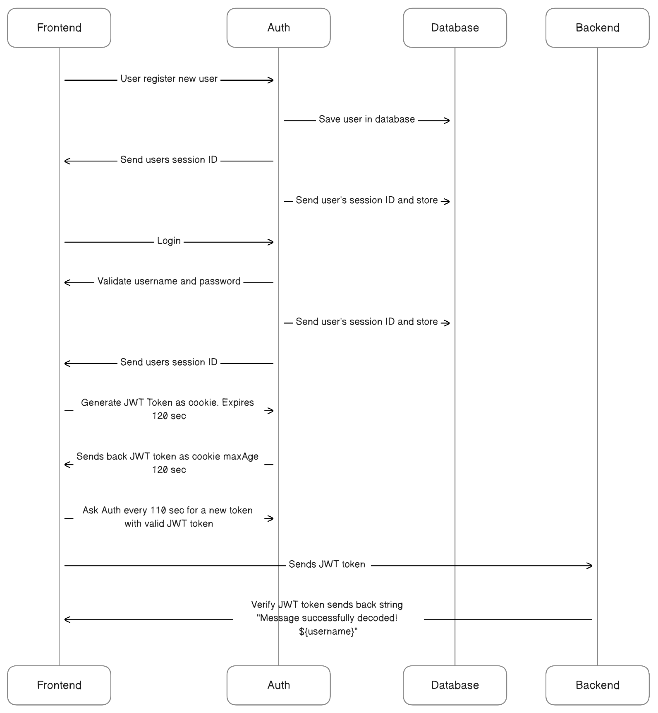

## **Kurs**: Webbsäkerhet analys och implementation




### Grupp : 

* Yulia Gutorova
* Jonathan Nilsson   


### Uppgift: Frontend för autentisering och auktorisering

**Mål**: *"Målet är att utrusta våra
studenter med rudimentär kunskap och praktiska färdigheter för att förstå säkerhetskrav och
lagstiftning som påverkar frontendutvecklare och att implementera säkerhetsåtgärder i frontend
som är kompatibla med backend-systemen."*

**Hur vi löste uppgiften:** *Teamet valde att försöka lösa uppgiften genom att implementera olika tekniker.* <br> **Autentisering:** *Passport-integration med local-strategy(Användarnamn och lösenord) samt google-recaptcha-v2*<br>
**Auktorisering:**  *Teamet valde att använda sig utav sessions och cookies i detta projekt, eftersom det ansågs säkrare än att förvara datan i dem istället för localstorage hos respektive användare.*

### Starta projektet:

```js
git clone https://github.com/yulia-gutorova/websec-frontend.git](https://github.com/Jonathannilsson90/websec-backend.git)
npm install
npm run dev
```

### Npm-paket som nyttjas i projektet:
```js
cookie-parser
cors
express
helmet
jsonwebtoken
```

### Relaterande repositories:
* [Frontend](https://github.com/yulia-gutorova/websec-frontend)
* [Authentisering/Auktoriserings-server](https://github.com/Jonathannilsson90/websec-auth-server.git)
